# Powdered Activated Carbon Tool

The Shiny-PAC Modeling Tool is used to model a powdered activated carbon (GAC) unit operation in a drinking water treatment plant.

1. [Requirements](#requirements)
2. [Excel Formatting](#excel-based-input-file)
3. [Quick Start](#quick-start)
4. [Appendix](#appendix)
5. [Notes to the User](#notes-to-the-user)
6. [Development Team](#development-team)

## Requirements 
1. R/R Studio (At least version 2022.7)
2. Python (At least version 3.9.7)
3. Excel (recommended)
4. Files: GACapp.R, GAC_config.xlsx
5. Optional: Example_TCE.xlsx

## Excel-based Input File
The input for the Excel-based input file must be formatted like the one shown in the figure below if the user wants to import data. The Shiny-PAC App looks for sheetnames of "Contactor", "PAC Characteristics", and "Compounds". If one or more of those sheets are not found then the app cannot be run using that input file. The App is loaded with default data (found in 'PAC_config.xlsx') if the user does not want to use an Excel-based file, which can be modified as needed within the GUI.

<figure>
     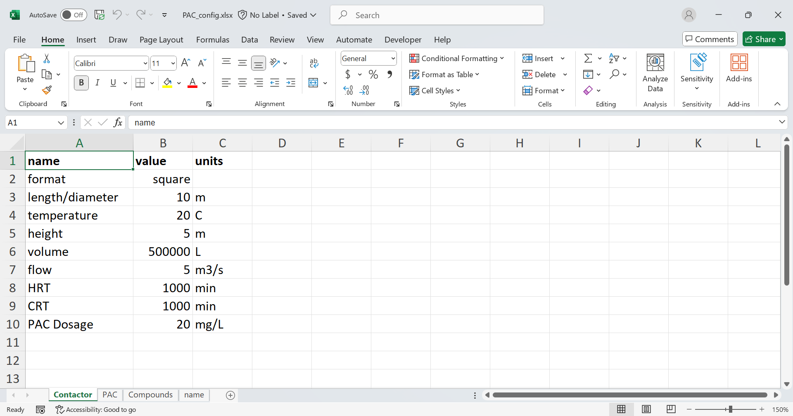
</figure>

<figure>
    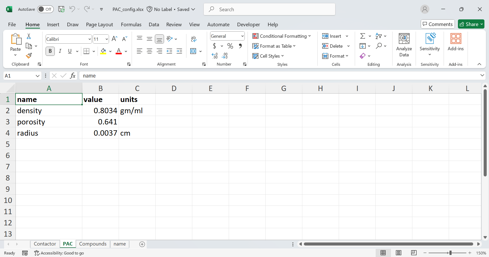
</figure>

<figure>
    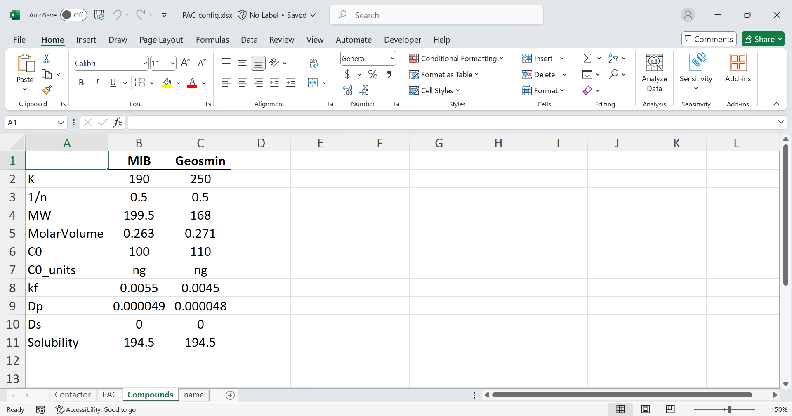
    <figcaption>The Excel file consists of three sheets: 
    </figcaption>
</figure>

&nbsp;

## Set Up

In order for the tool to work the user must point their R Studio to a Python Interpreter. If you are using the web version you can jump to Quick Start step 2.

1. Open RStudio

<figure>
    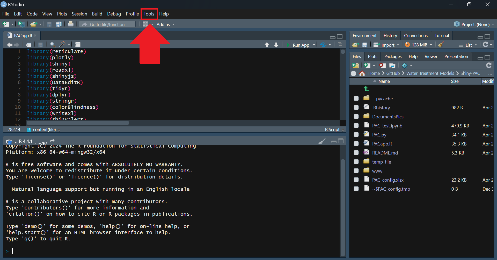
</figure>

2. Select the "Tools" tab at the top of the page and then select "Global Options"

<figure>
    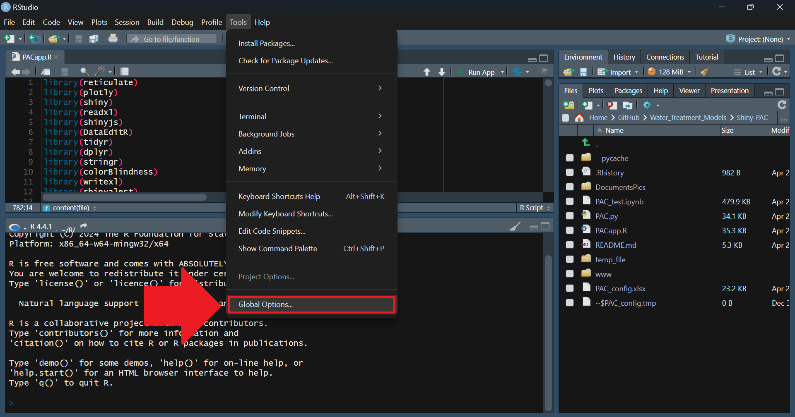
</figure>

3. Go to the Python tab in Global Variables, then select 'Browse' and select the file where Python is installed locally.

<figure>
    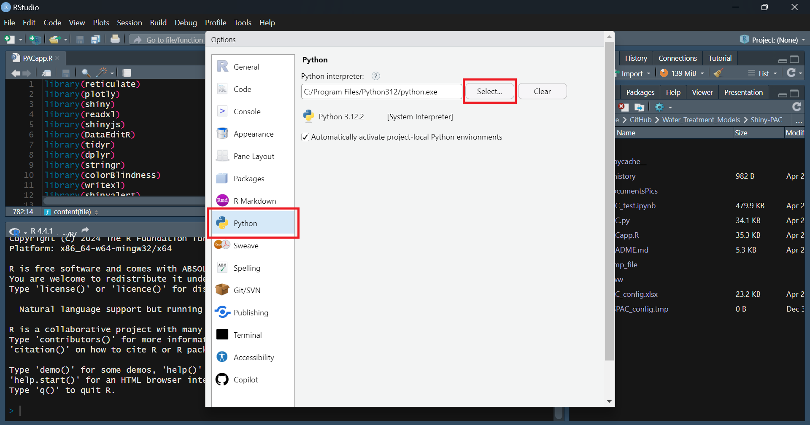
</figure>

4. Click "Apply" then "OK"

NOTE: The following packages must be installed in the Python version being used; numpy, scipy, pandas, and matplotlib.

## Quick Start

1. In RStudio, click the "Run App" button in the top right corner of the window that contains the code

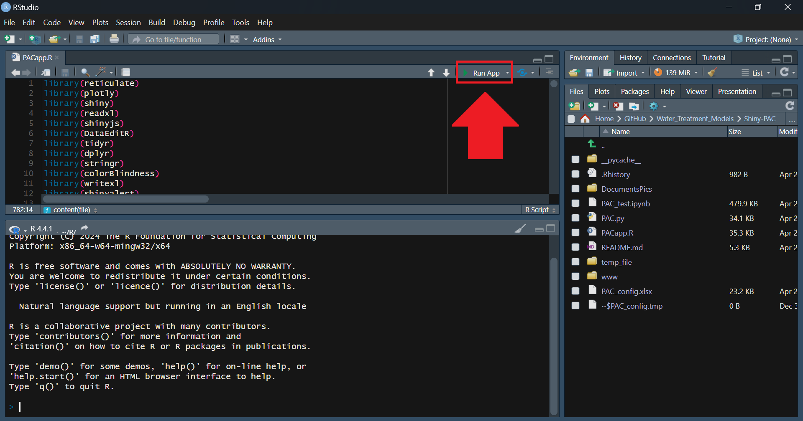

2. Application opens to Input & Column Parameter view. User can select "Browse" below "Choose .xlsx File" to import preconfigured input file in the upper left, as shown. Or, a user can begin editing input values following steps 4 and 5 below.

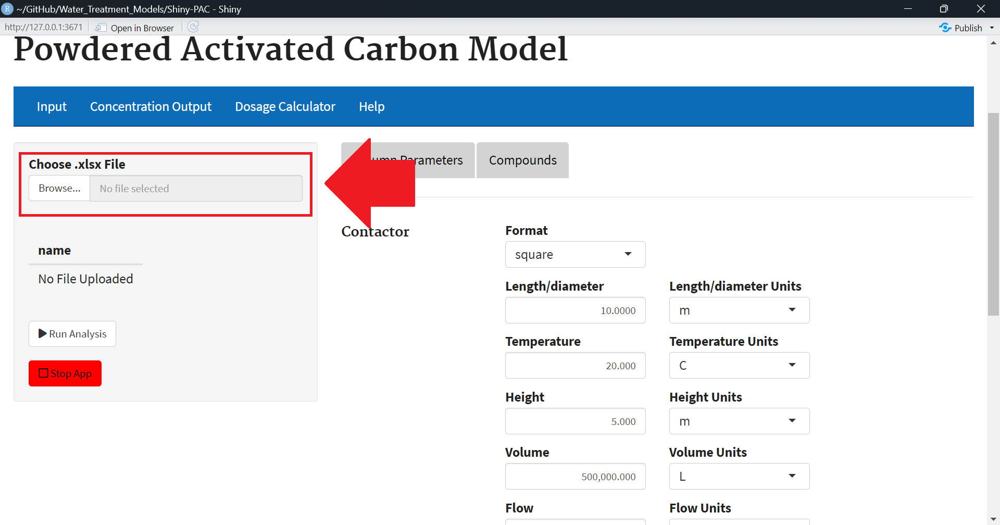

3. (Optional) Change the parameters to match the specifications of your Powdered Activated Carbon apparatus. This can be done by typing in a number or using the scroll wheel to increment the number up or down.

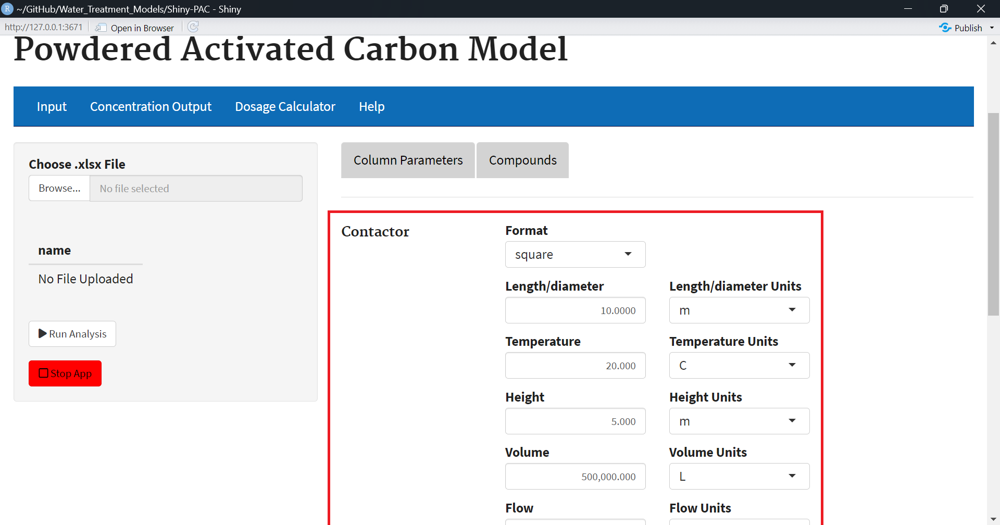

4. (Optional) In the compounds tab, add chemicals and concentration points to match your interest. These can be added or edited by right clicking the data table.

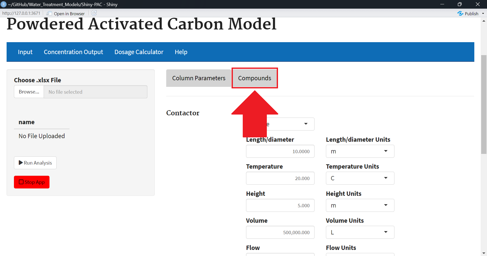
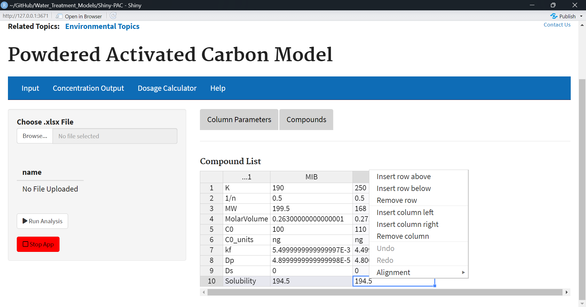

5.	Click the Run Analysis button that’s at the bottom of the same side panel as the file import.

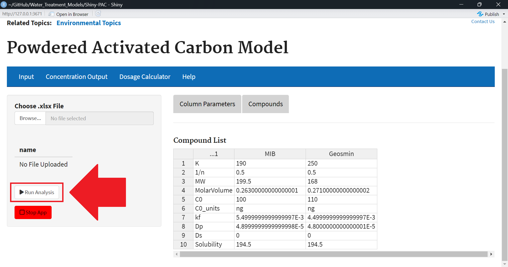

6.	Switch to the Concentration Output tab by clicking on it (There should be a loading “spinner” to let you know it’s running). Your graph will appear. You can export the data as an xlsx file along with the conditions you input.

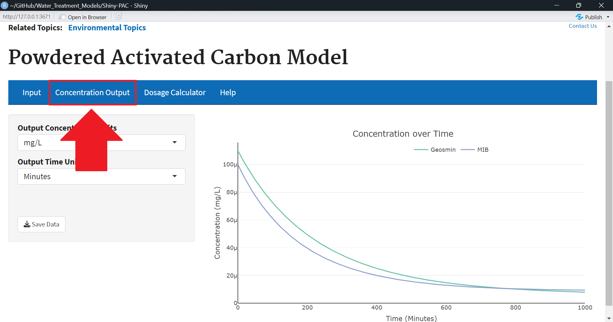

8. The user can change the output units with the drop down menus on the left. Note that the user can toggle on and off individual traces on the graph by clicking on the desired data on the legend (data will be grayed out if it isn't displayed).

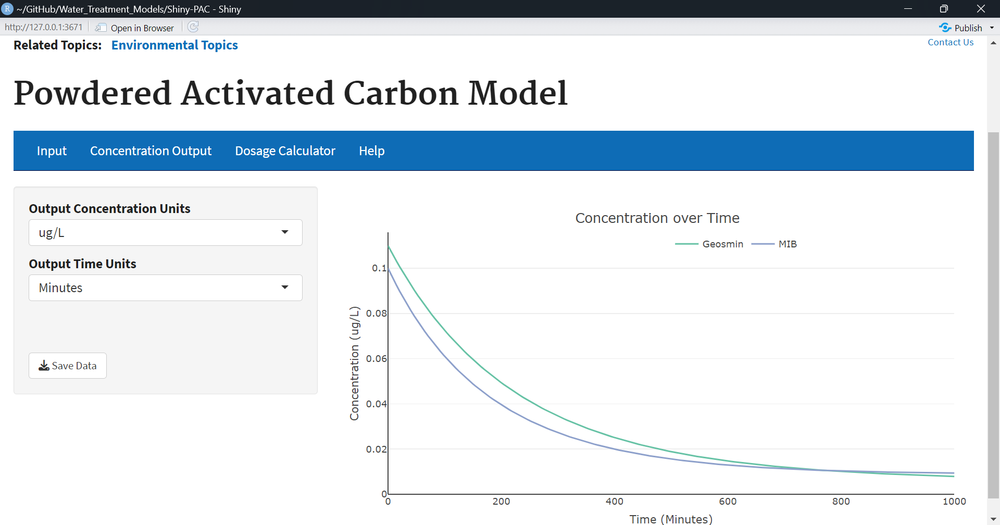

9. (Optional: Dosage Calculator) Switch to the Dosage Calculator tab by clicking on it. The user can perform calculations for different dosage levels. To do this, simply click the 'Calculate' button above the 'Save Data' button on the side bar panel (There should be a loading “spinner” to let you know it’s running). Click on the 'Concentration by Dosage' and 'Time for Target' tabs to view the respective graphs.

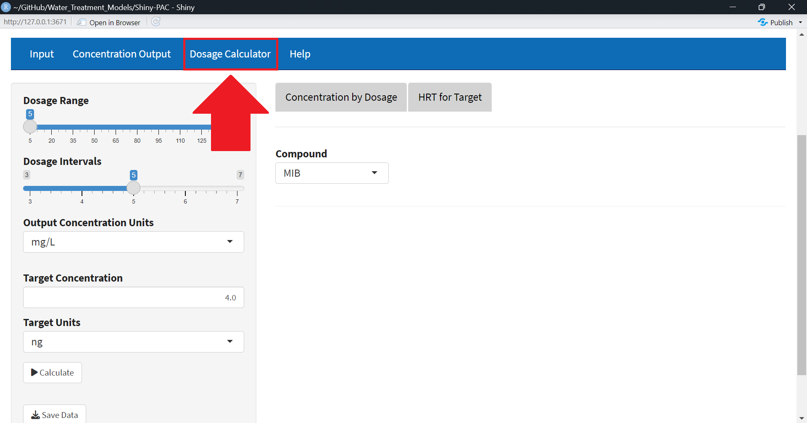

10. In the 'Concentration by Dosage' tab only one compound can be viewed at a time. It can be selected by using the Compound drop down menu. The Dosage range can be selected by selecting a range with the slider. The Dosage Interval value can be selected with a similar slider. The output concentration units can be changed by using the Output Concentration Units drop down menu.

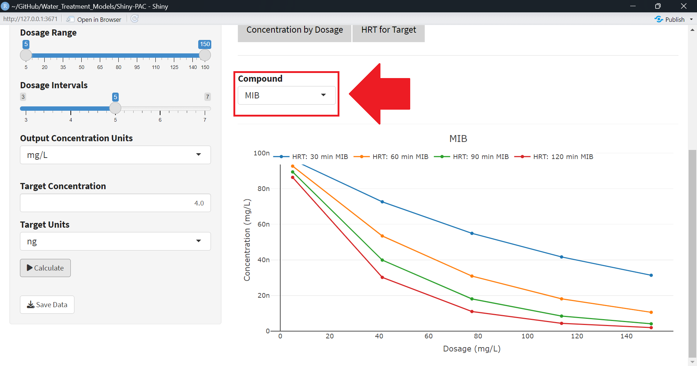

11. In the 'HRT for Target' tab Target Concentration and Target Units can be selected by using the respective drop down menus.

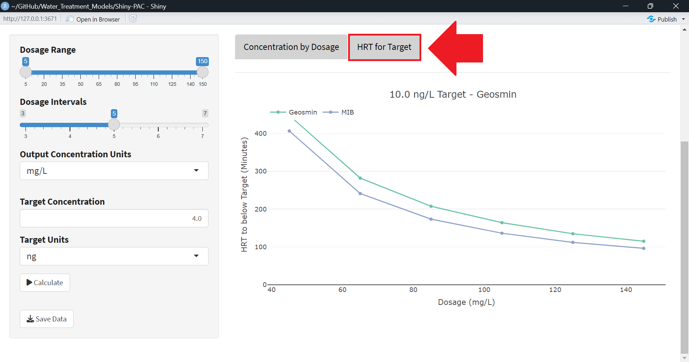

## Appendix

### Column Parameters

| Input | Description | Default Units
|--- |--- |---
|format | |N/A
|length/diameter | |m
|temperature | |C
|height | |m
|volume | |L
|flow |The average flow rate through the column. PSDM only considers and average or steady-state condition, not variable flow. |m3/s
|HRT |Hydraulic retention time. |min
|CRT |Cell residence time. |min
|PAC Dosage | |mg/L
|density |Mass per unit volume of bead particle. |gm/ml
|porosity | The bead porosity is the measure of the bead volume occupied by a solvent, usually water. The factor is between 0 and 1, where 0 represents a bead absent of a solvent and 1 is a bead where all the available space is filled with a solvent. A well packed bead will typically have and EPOR of 0.2. |N/A
|radius |Bead radius is the measurement of the distance of the bead resin from the center to the surface. |cm

### Compounds Tab

The Compounds tab contains information about the compounds to be simulated. The Compounds tab should contain any compounds found in the system. Compound characteristics (molecular weight, molar volume, etc.) are stored in the "Compounds" sheet in Excel-based input files and listed under "Compound List" within PAC under the Input>Compounds tab.

### Compound List
| Input | Description | Units
|--- |--- |---
|K |Freundlich K |
|1/n |Freundlich 1/n |
|MW |Molecular Weight |
|MolarVolume |Molar Volume |
|C0 |Initial influent concentration |
|C0_units |Initial influent concentration units |
|kf |Film transfer diffusion coefficient |cm/s
|Dp |Pore diffusion coefficient |cm2/s
|Ds |Surface diffusion coefficient |cm2/s
|Solubility |Amount of substance that will disolve in water |

## References

## Development Team
Jonathan Burkhardt

Cole Sandlin