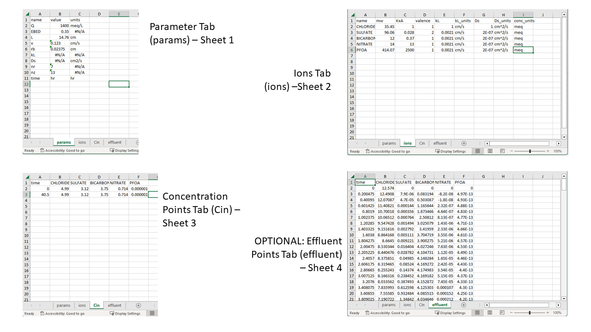
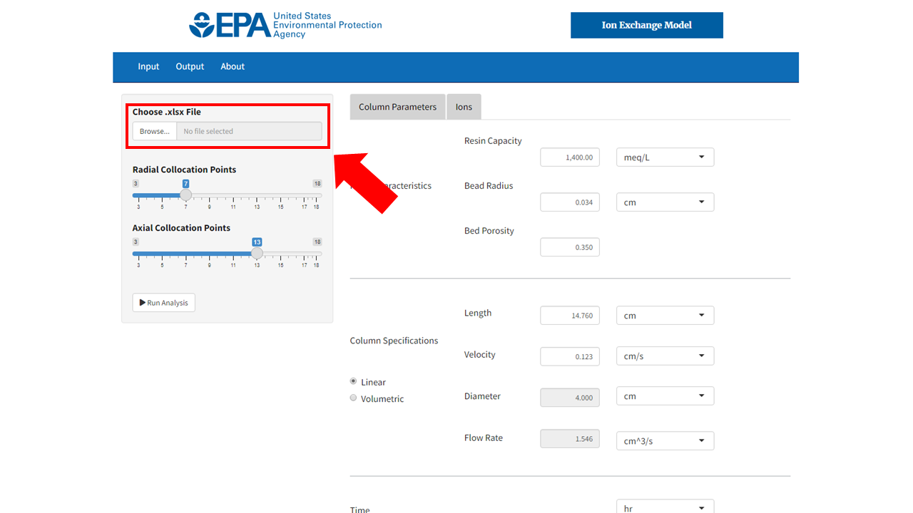
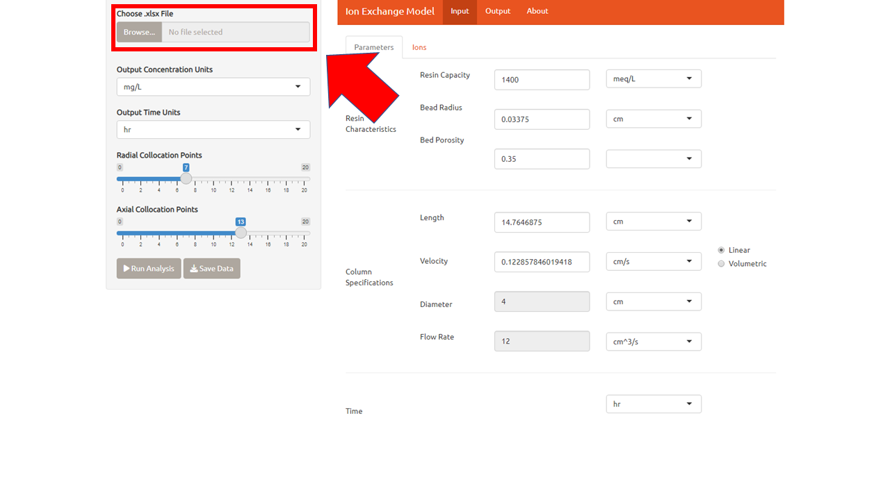
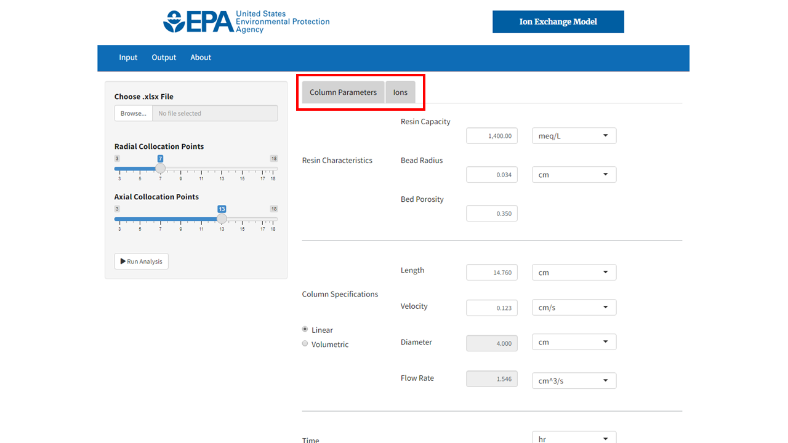
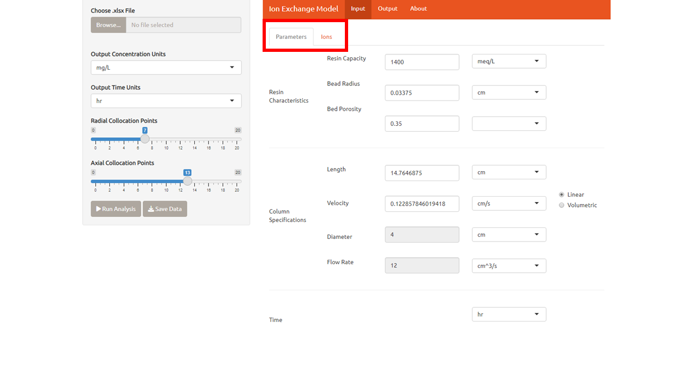
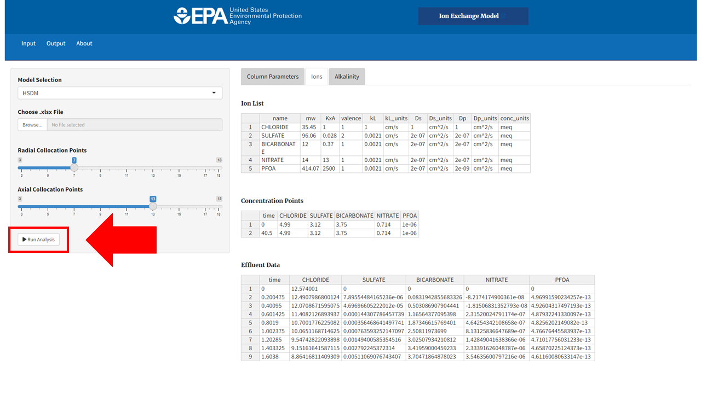
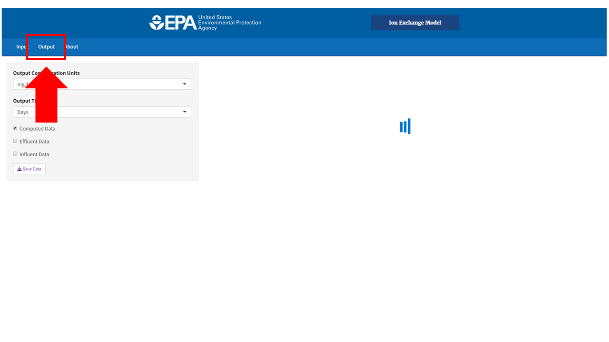
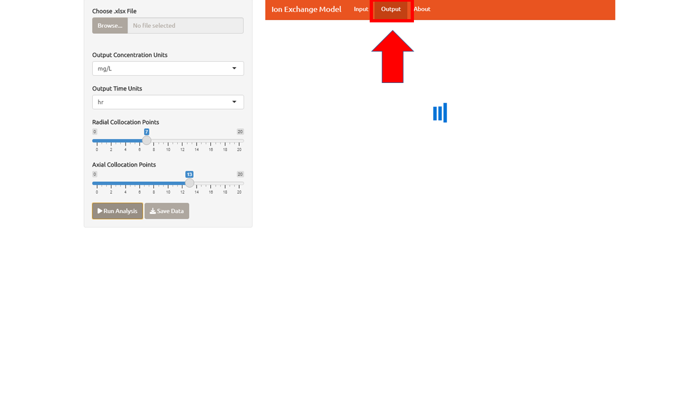

# Ion Exchange Modeling Tool

The Ion Exchange Model is a tool used to model a strong-base anion exchange unit operation in a drinking water treatment plant. This model relies on selectivity coefficient parameters and other information about the anion exchange resin and predicts the breakthrough behavior for unit operation design. To read a further in-depth analysis of the theory behind this model please reference [Anion Exchange Resin and Inorganic Anion Parameter Determination for Model Validation and Evaluation of Unintended Consequences during PFAS Treatment](https://pubs.acs.org/doi/10.1021/acsestwater.2c00572)[1](#1).

1. [Excel Formatting](#excel)
2. [Quick Start](#quick-start)
3. [Appendix](#appendix)

## Excel 
The input for the excel file must be formatted like the one shown in figure 1 if the user wants to import data.

<figure>
    
    <figcaption>The excel file consists of three sheets: parameters of the system, the list of ions that the user is interested in along with their properties, and the list of concentrations for the ions at a given time. Each tab is broken down in detail in the features section of this document.</figcaption>
</figure>

&nbsp;

## Quick Start

1. Click import file in the top left of the Interface

2. (Optional) Change the parameters to match the specifications of your Ion Exchange apparatus

3. (Optional) In the ions tab, add chemicals and concentration points to match your interest. These can be added or edited by right clicking the data table.

3.	Click the run button that’s at the bottom of the same side panel as the file import. 5 total chemicals with 2 concentration points takes about 1-2 minutes.

4.	Switch to the output tab (There should be a loading “spinner” to let you know it’s running)

5.	Your graph will appear. You can export the data as an xlsx file along with the conditions you input.

## Appendix

### Parameters

The parameters tab is used to describe the physical constraints of the resin characteristics and column specifications. Some of these measurements, like Resin Capacity, can be nontrivial to measure so we have tried to supply a source where the user can find the information if they do not have it already.

|  Input        				|Variable  | Description    |
|---            				|---       |---            |
|Resin Capacity 				|     Q    | Resin capacity is a measurement of the total capacity of PFAS that can be absorbed by a volume of resin. This capacity is expressed in quantity per unit volume. The value needs to be determined experimentally by titration, usually given by the manufacturing company.  [Read More](https://pubs.acs.org/doi/10.1021/acsestwater.2c00572)    |
|Bead Radius    				|     rb   | Bead radius is the measurement of the distance of the bead resin from the center to the surface.              |        
|Bed Porosity   				|     EBED | The bed porosity is the measure of a bed volume occupied by a solvent, usually PFAS chemicals. This factor is between 0 and 1, where 0 represents a bed absent of a particular solvent and 1 is a bed where all the available space is filled with solvent.              |        
|Length         				|     L    |The depth of the media. Some vessels may only be filled partially, so this number may not reflect the physical length of the contractor.              |        
|Velocity  					|     v    | The linear velocity that represents the distance an average water particle travels over a given period of time.     |    
|Diameter   				|     d    |  The longest distance between one point to the other of the exit.             |        
|Flow Rate					|	fr   | The flow rate represents the distance one unit volume travels through the cylinder over a given period of time. |        
|Radial Collocation Points		|	nr   | Number of grid points used to model transport inside the resin beads.                |        
|Axial Collocation Points		|	nz   | Number of grid points used to model transport through the column.                |        
     

#### Notes of Resin Capacity (Q)
The total ion exchange capacity of the resin (Q) is one of the critical input parameters in the HSDMIX Shiny application. This quanitity is defined as the concentration of available exchange sites per unit volume inside a resin bead. This basiss is used in the unerlying model equations. However, several other conventions for defining this quanitity are used in practice. The filter capacity (Qf) is commonly provided by resin manufacturers and corresponds to the concentration of fixed sites per volume of the resin bed (that is, the filter). The values of Q and Qf are related by bed porosity ($\epsilon$) [EBED in HSDMIX] through equation 1.

$$ Q={Q_f \over 1-\epsilon} \label{eq505}\tag{1} $$

Typical units for Q and Qf in the literature are meq/mL, meq/L, or eq/mL. Alternatively, the ion exchange capacity of a resin is sometimes defined on a dry weight basis (Qm). The dry weight capacity can be related to Q either by apparent resin density ($\rho$a)[RHOP in a Python version of HSDMIX], which is the dry mass of a pellet divided by the pellet's volume when fully hydrated, or through the apparent resin density of the bed ($\rho$*), which is the mass of dry resin per filter volume. The relationships between Qm and Q are given by equation 2.

$$ Q = {\rho^* Q_m \over 1-\epsilon} = {\rho_a Q_m} \label{eq105}\tag{2}$$

Because resin volume and density can change with ionic composition of the resin, Q, Qf, and Qm may be different for resin in different ionic forms (for instance, hydroxide vs chloride forms of anion exchange resins). There is also some variability in the literature on what is considered "dry" (completely dry, or air dry) for Qm. The user is advised to carefully check data sources for resin capacity carefully on these matters. 

#### Selection of Collocation Points (nr and nz)
The parameters nr and nz control the size of the grid used to numerically solve the underlying differential equations during the simulation. Increasing nr and nz may increase the accuracy of simulations but doing so also makes them take longer to run. No analytical expression has been found for determining optimal grid dimensions for this class of problems, so selecting nr and nz may take some experimentation. Generally, the sharper the ion exchange zone is relative to the column length, the higher nz will need to be and the sharper the diffusion gradient in the resin beads becomes, the higher nr will need to be. In practice, it is rare for nr to be the controlling parameter for grid size, with nr=7 being accurate enough for most cases without unduly increasing computational cost. The parameter nz is more likely to need attention. Setting nz too low will often produce spurious oscillations in the breakthrough curves. The illustration below shows simulations with (a) and without (b) these spurious oscillations.

If increasing nz does not damp out the spurious oscillations, there may be other problems with the simulation. In this case, the user is advised to double check the inputs for errors. If there are no errors in the inputs, it is possible the ion exchange zones in the requested simulations are simply too sharp for this numerical approximation to handle. Faced with this problem, the user may wish to consider reducing the empty bed contact time of the simulation or seek out an alternate method of solution such as an equilibrium-based column model.

#### Specifying Column Size and Flow Rate

The underlying model equations in this code use column length (bed depth), L, to define filter size and superficial (linear) flow velocity, v, to define flow rate of simulated systems. If both parameters are readily available to the user, they can be input directly selecting the “linear” radio button on the left side of the column specification section. In practice, flow in adsorption systems is often specified as a hydraulic loading rate (or “surface loading rate”) given in units of volumetric flow rate divided by area (for instance, with units of gpm/ft2). This specification is ultimately equivalent to specifying a superficial flow velocity and can also be entered directly for v provided appropriate units are selected from the corresponding drop-down menu. 

Occasionally design specification may include bed dimensions and empty bed contact time (EBCT) but omit flow information. In this case, the user can obtain a superficial flow velocity from the following formula:

$$ v={L \over [EBCT]} \label{eq605}\tag{3} $$

The column size and flow rate may also be defined in terms of L, bed diameter (d), and volumetric flow rate (fr) by selecting the “volumetric” radio button.
A note on selection of flow convention: The entry field for the two conventions are independent. The values shown in disabled fields (gray backgrounds) are not updated to correspond to values entered using the other convention. Thus, switching between the radio buttons usually results in switching between two different systems.

### Ions
The ions tab is present in order to organize the chemicals that are present in the analysis. This tab can be updated in either excel or in the Ion Exchange app. The ions are added by row with the columns in order being name, molecular weight, KxA, valence, film transfer coefficient, and surface diffusion coefficient. Chloride, Sulfate, Bicarbonate, and Nitrate should always be in the ions tab.

|  Input        	                |Variable   | Description                                                                      |
|---            				    |---        |---                                                                               |
|Molecular Weight               |mw         |The sum of all the masses in a molecule                                           |           |
|Selectivity                   |KxA        |Reactivity of an ion relative to chloride   [Read More](https://pubs.acs.org/doi/10.1021/acs.est.1c00769) |                     
|Valence                            |           |The number of electrons that a given element or chemical can lose.                |
|Film Transfer Coefficient      |kL         |Mass transfer coefficient in the boundary of the beads                            |
|Surface Diffusion Coefficient  |Ds         |Diffusion coefficient of the chemical in the media                                |

### Initial Concentration

The initial concentration represents the ratio of a mass to a given volume in this case is mg/L. The time of the final concentration determines the run duration of the analysis. As the model stands now, there is no data in the model to represent the concentration after the final concentration time. There have been discussions to plot data past the final concentration time but these will just be estimations.

### Output
The output concentration is given in units of mass divided by volume or by a ratio of the concentration of time t and the initial concentration.
The time can be changed to various units including bed volumes, which is the length of the bed divided by velocity. Both the concentration outputs and the time outputs can be converted before or after the analysis is ran, unlike the rest of the inputs.

The data can be exported by clicking the save button. This saves the data points to an excel file where the chemicals inputted into the analysis are the header and the columns are the corresponding concentration points with the first column being the corresponding time.

## References
ACS EST Water 2023, 3, 2, 576–587
Publication Date:January 19, 2023
https://doi.org/10.1021/acsestwater.2c00572

Environ. Sci. Technol. 2021, 55, 8, 5001–5011
Publication Date:March 22, 2021
https://doi.org/10.1021/acs.est.1c00769
