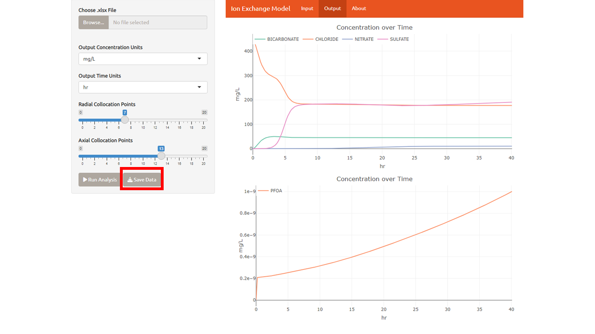

# Ion Exchange Modeling Tool

The Ion Exchange Model is a tool used to model a strong-base anion exchange unit operation in a drinking water treatment plant. This model relies on selectivity coefficient parameters and other information about the anion exchange resin and predicts the breakthrough behavior for unit operation design. To read a further in depth analysis of the theory behind this model please reference [Anion Exchange Resin and Inorganic Anion Parameter Determination for Model Validation and Evaluation of Unintended Consequences during PFAS Treatment](https://pubs.acs.org/doi/10.1021/acsestwater.2c00572)[1](#1).  This tool can be used to determine if Ion Exchange or another method like Granular Activated Carbon is the most efficient for a given water treatment facility.

1. [Excel Formatting](#excel)
2. [Quick Start](#quick-start)
3. [Reference](#reference)

## Excel 
The input for the excel file must be formatted like the one shown in figure 1 if the user wants to import data.

<figure>
    
    <figcaption>The excel file consists of three sheets: parameters of the system, the list of ions that the user is interested in along with their properties, and the list of concentrations for the ions at a given time. Each tab is broken down in detail in the features section of this document.</figcaption>
</figure>

&nbsp;

## Quick Start

1. Click import file in the top left of the Interface

2. (Optional) Change the parameters to match the specifications of your Ion Exchange apparatus

3. (Optional) In the ions tab, add chemicals and concentration points to match your interest. These can be added or edited by right clicking the data table.

3.	Click the run button that’s at the bottom of the same side panel as the file import. 5 total chemicals with 2 concentration points takes about 1-2 minutes.

4.	Switch to the output tab (There should be a loading “spinner” to let you know it’s running)

5.	Your graph will appear. You can export the data as an xlsx file along with the conditions you input.

## Reference 

### Parameters

The parameters tab is used to describe the physical constraints of the resin characteristics and column specifications. Some of these measurements, like Resin Capacity, can be nontrivial to measure so we have tried to supply a source where the user can find the information if they do not have it already.

|  Input        				|Variable  | Description    | Source |
|---            				|---       |---            |---        |
|Resin Capacity 				|     Q    | Resin capacity is a measurement of the total capacity of PFAS that can be absorbed by a volume of resin. This capacity is expressed in quantity per unit volume. The value needs to be determined experimentally by titration, usually given by the manufacturing company.      |
|Bead Radius    				|     rb   | Bead radius is the measurement of the distance of the bead resin from the center to the surface.              |        |
|Bed Porosity   				|     EBED | The bed porosity is the measure of a bed volume occupied by a solvent, usually PFAS chemicals. This factor is between 0 and 1, where 0 represents a bed absent of a particular solvent and 1 is a bed where all the available space is filled with solvent.              |        |
|Length         				|     L    |Effective length of the column.               |        |
|Velocity  					|     v    | The linear velocity that represents the distance an average water particle travels over a given period of time.     |    |
|Diameter   				|     d    |  The longest distance between one point to the other of the exit.             |        |
|Flow Rate					|	fr   | The flow rate represents the distance one unit volume travels through the cylinder over a given period of time. |        |
|Radial Collocation Points		|	nr   |Mathetmical Object used to stablilize numeric fluctuations in a differential equation.               |        |
|Axial Collocation Points		|	nz   |               |        |
|Volumetric and Linear Velocity	|        |There are two options for chosing the input velocity: Volumetric (Flow rate) or Linear. Both options are available in this tool. If volumetric velocity is chosen, then length, diameter, and flow rate must all be supplied before the analysis is ran. If linear velocity is chosen then the user only needs length and velocity. This is because the tool by default takes linear velocity and when a volumetric velocity is given then the flow rate must be converted to linear velocity.               |        |

#### Notes of Resin Capacity (Q)
The total ion exchange capacity of the resin (Q) is one of the critical input parameters in the HSDMIX Shiny application. This quanitity is defined as the concentration of available exchange sites per unit volume inside a resin bead. This basiss is used in the unerlying model equations. However, several other conventions for defining this quanitity are used in practice. The filter capacity (Qf) is commonly provided by resin manufacturers and corresponds to the concentration of fixed sites per volume of the resin bed (that is, the filter). The values of Q and Qf are related by bed porosity ($\epsilon$) [EBED in HSDMIX] through equation 1.

$$ Q={Q_f \over 1-\epsilon} $$

Typical units for Q and Qf in the literature are meq/mL, meq/L, or eq/mL. Alternatively, the ion exchange capacity of a resin is sometimes defined on a dry weight basis (Qm). The dry weight capacity can be related to Q either by apparent resin density ($\rho$a)[RHOP in a Python version of HSDMIX], which is the dry mass of a pellet divided by the pellet's volume when fully hydrated, or through the apparent resin density of the bed ($\rho$*), which is the mass of dry resin per filter volume. The relationships between Qm and Q are given by equation 2.

$$ Q = {\rho^* Q_m \over 1-\epsilon} = {\rho_a Q_m} $$

Because resin volume and density can change with ionic composition of the resin, Q, Qf, and Qm may be different for resin in different ionic forms (for instance, hydroxide vs chloride forms of anion exchange resins). There is also some variability in the literature on what is considered "dry" (completely dry, or air dry) for Qm. The user is advised to carefully check data sources for resin capacity carefully on these matters. 

### Ions
The ions tab is present in order to organize the chemicals that are present in the analysis. This tab can be updated in either excel or in the Ion Exchange app. The ions are added by row with the columns in order being name, molecular weight, KxA, valence, film transfer coefficient, and surface diffusion coefficient. Chloride, Sulfate, Bicarbonate, and Nitrate should always be in the ions tab.

|  Input        	                |Variable   | Description                                                                      | Source    |
|---            				    |---        |---                                                                               |---        |
|Molecular Weight               |mw         |The sum of all the masses in a molecule                                           |           |
|Selectivity                   |KxA        |Reactivity of an ion relative to chloride                                         |[Source](https://pubs.acs.org/doi/10.1021/acs.est.1c00769)       |
|Valence                            |           |The number of electrons that a given element or chemical can lose.                |           |
|Film Transfer Coefficient      |kL         |Mass transfer coefficient in the boundary of the beads                            |           |
|Surface Diffusion Coefficient  |Ds         |Diffusion coefficient of the chemical in the media                                |           |

### Initial Concentration

The initial concentration represents the ratio of a mass to a given volume in this case is mg/L. The time of the final concentration determines the run duration of the analysis. As the model stands now, there is no data in the model to represent the concentration after the final concentration time. There have been discussions to plot data past the final concentration time but these will just be estimations.

### Output Concentration
The output concentration is given in units of mass divided by volume, however, this number is also adjusted 
### Output Time
The output time on the parameters tab represents the time units in the 

### Exporting Data

The Ion Exchange Model is meant to take the input of the users water treatment specifications as well as their ions they want to remove from the water and their concentrations before the ions enter the treatment process.

## References
###[1]
